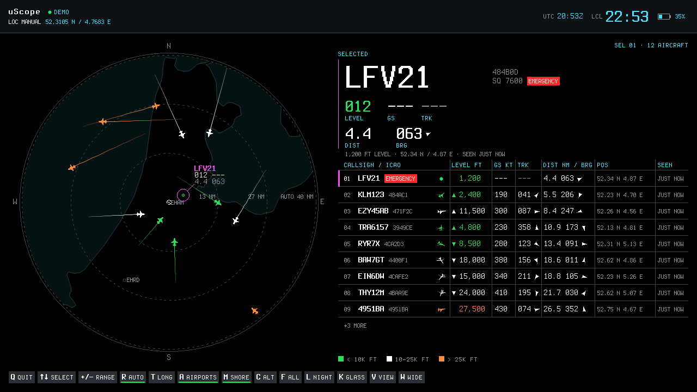
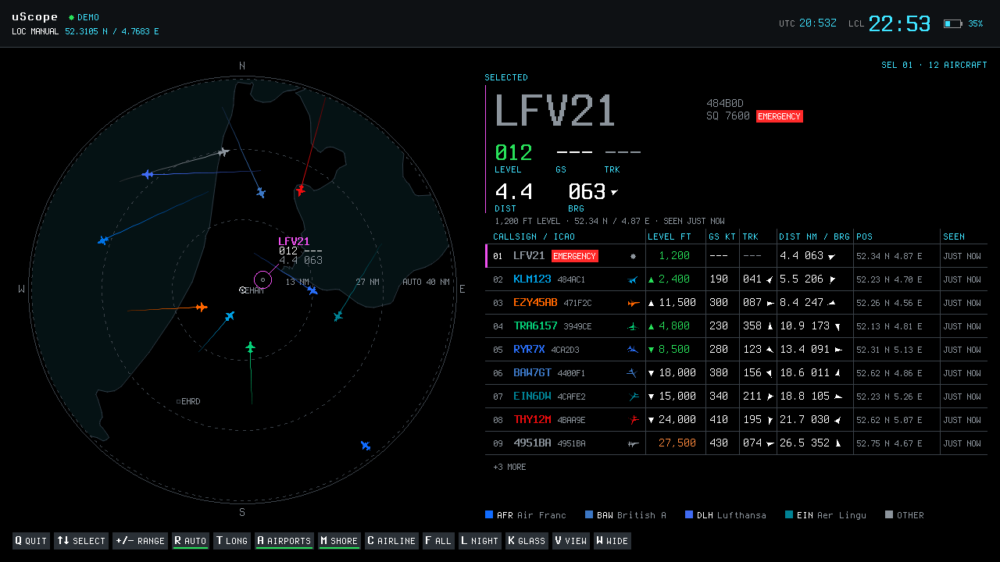
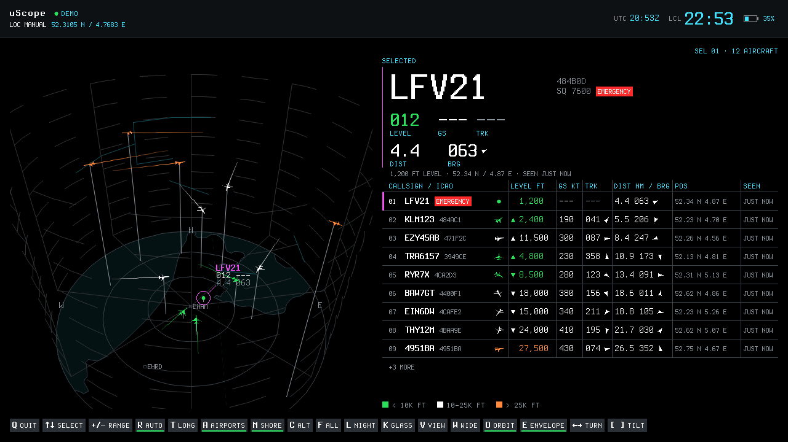
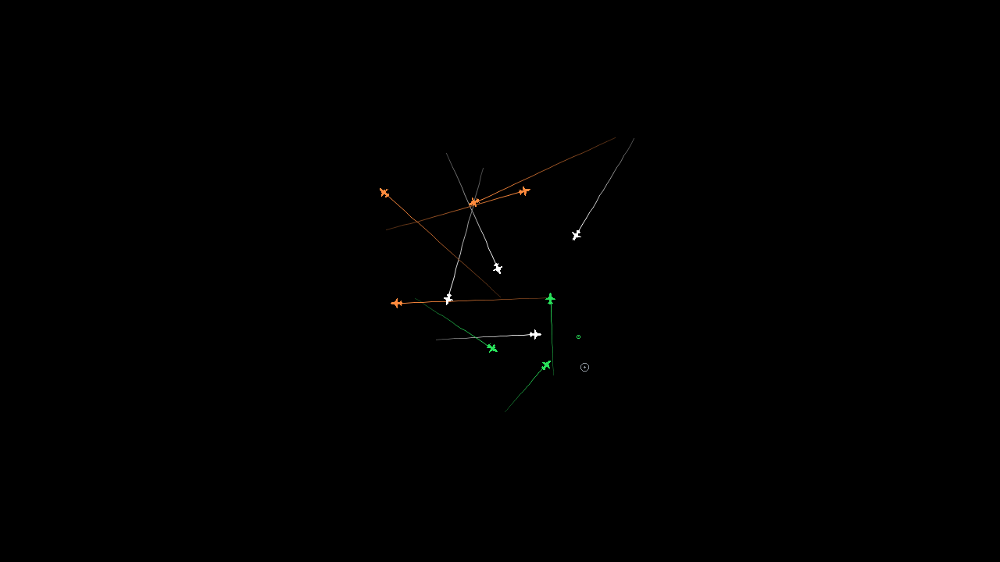
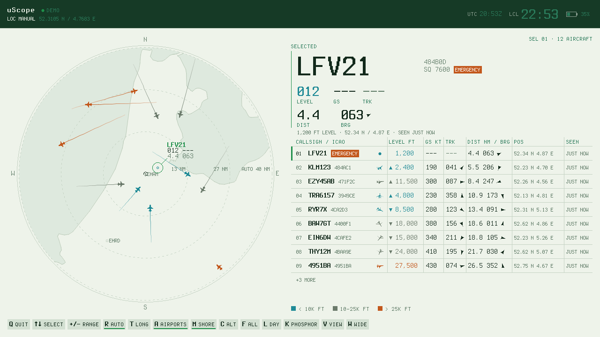
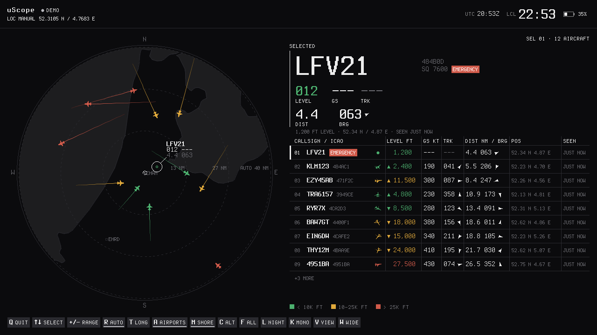

# uScope

An ADS-B radar scope for the ClockworkPi uConsole, drawn pixel by pixel on
the panel. One static binary, started from the shell, keyboard driven, `q` to
get back to the prompt.



Aircraft come in over the uConsole's own RTL-SDR, from a Mode S BEAST feed on
another machine, from a captured IQ file, or from an invented fleet so you can
try it at a desk with no receiver at all. Each one is drawn as a silhouette
turned to its heading with the trail it flew in on, coloured by altitude or by
the airline it is flying for. Around them: the coastline, the water, the
airfields, range rings, a panel for the selected flight and a table of the
rest.

uScope is the sister of [uAirwaves](https://github.com/hyperized/uAirwaves),
which does the same job in character cells with tview. uAirwaves is also where
the decoding comes from: uScope imports its ADS-B, GPS, battery and
self-locate packages and adds nothing but the picture.

It runs on a Mac too. Ghostty and other terminals that speak the Kitty
graphics protocol show the same frames in a window, and any terminal with
24-bit colour gets a half-block version. That is how the screenshots on this
page were made.

## What you see

### The scope

The picture above. Range rings measured from the receiver, cardinal letters,
the nearest airfields by ICAO code, and the Dutch coast at whatever range is
on. The range fits itself to the traffic unless you pin it with `+` and `-`.

The right column is the selected flight on top, the rows below it and the
legend at the bottom. Until you pick one, the selection follows the nearest
aircraft. `n`, `p` and the arrow keys pin it, and Esc lets go again. A squawk
of 7500, 7600 or 7700 puts `EMERGENCY` on the panel and on the row in red,
which is the one red thing on the whole screen.

Colour means altitude by default: green under 10,000 ft, white to 25,000,
orange above. `c` switches to colouring by airline, read off the callsign
prefix, and the legend lists the four busiest operators in view. `f` filters
the picture down to one entry of whichever legend is showing.



### The 3D view

`v` tilts the scope into perspective. Altitude becomes height, each aircraft
becomes a small model banked into its turn, and the camera orbits the receiver
once every two minutes. `e` draws the receiving envelope: the theoretical
radio horizon as a dashed bowl, and the measured one as a mesh built from
where the antenna has actually heard something, which is what shows a
directional antenna or a chimney in the way.



### Minimal

The third view is the aircraft and their trails on a bare field, with no
header, no column and no rings. With a directional antenna every contact
lands on one side, so minimal follows the traffic's own centre rather than the
receiver, gliding to a new centre every few minutes, and marks where the
antenna actually is with a small ring. `a` and `m` put the airfields and the
coast back if you want them. There is a bare 3D view as well, fourth on the
`v` cycle.



### Looks and themes

There are three looks, each with a night and a day palette. Glass is the
default, phosphor is a green CRT, and mono is black and white with the
altitude bands told apart by brightness. `k` cycles the look and `l` flips
night and day.

| | |
|---|---|
|  |  |

## Getting it running

You need Go 1.27 or later to build. There is nothing to install at runtime:
the fonts, the coastlines and the airline table are inside the binary.

### On the uConsole

Put your device in a `.env` next to the Makefile. It is gitignored:

```
DEVICE = user@uconsole-host
```

Then:

```sh
make pattern
```

That cross-compiles for arm64, copies the binary over ssh, and paints a test
pattern on the panel. A red square top left and a cyan triangle pointing up
means the rotation is right. If the pattern lands on the wrong edge, the
panel disagrees with what `/sys/class/graphics/fbcon/rotate` says, and
`--rotate 3` is the override.

From then on, at the uConsole's own shell:

```sh
./uScope
```

opens the local RTL-SDR and draws the radar on the panel. `./uScope --demo`
flies the invented fleet instead. It needs no root, only a user in the `video`
group so it can write `/dev/fb0`, which is the case on a stock uConsole image.

If gpsd is running on the device, uScope finds it on `localhost:2947` and the
header goes green when there is a fix. Without it, the receiver's position is
worked out from the aircraft, which takes a minute or two of traffic.

### On a Mac or any other machine

```sh
make run-demo
```

is `go run . --demo`. In Ghostty, kitty or WezTerm the frame is drawn at its
real pixel size. In any other terminal it falls back to half blocks, one
pixel per half cell, which is coarse but works everywhere:

```sh
make run-blocks
```

There is no radio on a Mac, so `--demo` or `--beast host:30005` are the ways
to get traffic. Both leave the shell as they found it.

### Over ssh

From a Kitty-protocol terminal on your desk, into the uConsole:

```sh
ssh -t user@uconsole-host './uScope --backend kitty'
```

The frames travel back over the connection and appear in your window while
the uConsole's own screen stays untouched. The `-t` matters: without a
terminal on the far end there is no window size and no keyboard, so no `q`.
`--backend blocks` is the one to reach for on a slow link.

### A still frame

```sh
./uScope --demo --png radar.png
./uScope --demo --view 3d --png radar-3d.png --size 1920x1080
```

renders one frame to a file, which is how every image on this page was made.

## Where the aircraft come from

| Flag | Source |
|---|---|
| none | the local RTL-SDR, opened through uAirwaves' own driver |
| `--beast HOST:PORT` | a Mode S BEAST feed over TCP, from readsb, dump1090 or `demod1090 --beast-listen` |
| `--replay-iq PATH` | a captured IQ file played back through the same demodulator |
| `--demo` | twelve invented aircraft on straight tracks, one of which goes quiet after ninety seconds |

`--bias-t` powers an LNA up the coax from the dongle, and `b` toggles it
while running. `--auto-sweep` walks the dongle's gain grid once before the
first frame and keeps the best cell. Both apply to the local SDR only; on a
BEAST feed the gain belongs to the other end.

## Where the receiver is

The header's second line says where the receiver is and how that is known,
and the ring around the home marker takes the same colour.

| Header | Ring | Means |
|---|---|---|
| `LOC GPS 3D 52.3100 N / 4.7683 E` | green | a gpsd fix |
| `LOC GPS LOST …` | amber | the fix went; the last position is held for thirty seconds |
| `LOC MANUAL …` | ink | `--lat` and `--lon` |
| `LOC EST ±4 NM / MAX 97 NM` | amber, dashed | worked out from the aircraft |
| `LOC NO FIX` | grey | nothing known yet, nothing plotted |

The estimate needs no GPS and no internet. Every aircraft heard constrains
the receiver to that aircraft's radio horizon, and the intersection of enough
of those is where you are. Two figures come with it: the spread, which is how
far the answer moves when it is worked out from a fifth of the observations,
and the bound, which is the size of the region the horizons admit. The dashed
ring is drawn at the spread. A `?` after them means the horizons cannot all be
true at once and the answer is a compromise.

## Keys

| Key | Does |
|---|---|
| `q` | quit |
| `v` | cycle the view: scope, 3D, minimal, bare 3D |
| `n`, Down | select the next aircraft |
| `p`, Up | select the previous one |
| `Esc` | let the selection follow the nearest aircraft again |
| `+`, `-` | widen or narrow the range by one step, and turn auto range off |
| `r` | auto range on or off |
| `t` | cycle the trails: off, short, long, all. All keeps the trails of aircraft that have gone quiet |
| `a` | airfield markers on or off |
| `m` | coastline and water on or off |
| `c` | colour by altitude or by airline |
| `f` | filter to one entry of the legend, then back to all |
| `l` | night or day |
| `k` | glass, phosphor or mono |
| `w` | hide the right column and give the picture the whole width |
| `b` | bias-tee on or off, when the source has one |
| `e` | 3D view: the receiving envelope on or off |
| `o` | 3D views: the camera orbit on or off |
| Left, Right | 3D views: turn the camera 15 degrees and stop the orbit |
| `[`, `]` | 3D views: tilt the camera |

Shifted letters do the same as unshifted, because caps lock is easy to hit on
the uConsole's keyboard. The key bar along the bottom shows every key that
does something in the view on screen, with its current state.

## Flags

| Flag | Default | Does |
|---|---|---|
| `--demo` | off | fly the invented fleet instead of decoding |
| `--demo-sector` | off | put the invented fleet in one quadrant, as a directional antenna would |
| `--beast` | | take Mode S frames from `HOST:PORT` |
| `--replay-iq` | | replay a captured IQ file |
| `--bias-t` | off | power an LNA over the coax; local SDR only |
| `--auto-sweep` | off | find the best gain before the first frame; local SDR only |
| `--gpsd` | `localhost:2947` on Linux, `off` elsewhere | where gpsd is, or `off` |
| `--lat`, `--lon` | | the receiver's position in degrees; turns gpsd and the estimate off |
| `--view` | `scope` | `scope`, `3d`, `minimal` or `minimal3d` |
| `--range` | `auto` | range in nautical miles, or `auto` to fit the traffic |
| `--colour` | `altitude` | `altitude` or `airline` |
| `--theme` | `night` | `night` or `day` |
| `--look` | `glass` | `glass`, `phosphor` or `mono` |
| `--airports` | `on` | airfield markers |
| `--shore` | `on` | coastline and water |
| `--exaggerate` | `8` | how far the 3D view stretches altitude into height, 1 to 20 |
| `--recenter` | `3m` | how often minimal mode recentres on the traffic, `10s` to `1h`, or `0` |
| `--backend` | `auto` | `fb`, `kitty`, `blocks` or `png`; `auto` picks the first that works |
| `--fb` | `/dev/fb0` | framebuffer device |
| `--rotate` | `auto` | read fbcon's rotation, or force `0` to `3` |
| `--battery` | | a `power_supply` uevent file to read the battery from; Linux only, found on its own otherwise |
| `--fps` | `30` | frames per second |
| `--frames` | `0` | stop after this many frames |
| `--png` | | render one frame to this file and exit |
| `--size` | `1280x720` | canvas size for `--png` and the kitty backend |
| `--test-pattern` | off | draw one frame of the test pattern and exit |
| `--scene` | `radar` | `radar`, or `pattern` for the rotation check |

Exit status is 0 on a clean quit and 1 on any failure.

## Building and testing

```sh
make build          # for the machine you are on
make build-aarch64  # for the uConsole
make test           # go test -race -cover ./...
make lint           # golangci-lint run ./...
make ship           # copy the uConsole binary to $(DEVICE)
make test-device    # run the framebuffer and terminal tests on the device
```

Everything is standard library apart from the `github.com/hyperized/*`
modules, and none of it needs cgo, so `make build-aarch64` cross-compiles
from any machine with Go on it. `make test` never opens a device; the tests
that need a real framebuffer or a real tty run on the uConsole through
`make test-device`.

`make shore-data` rebuilds the embedded coastlines from Natural Earth. It is
the one target that needs the network, and it only needs running when Natural
Earth publishes a new release.

## Licence

Business Source License 1.1, free for non-commercial use, becoming Apache 2.0
ten years after release. See [LICENSE](LICENSE).
